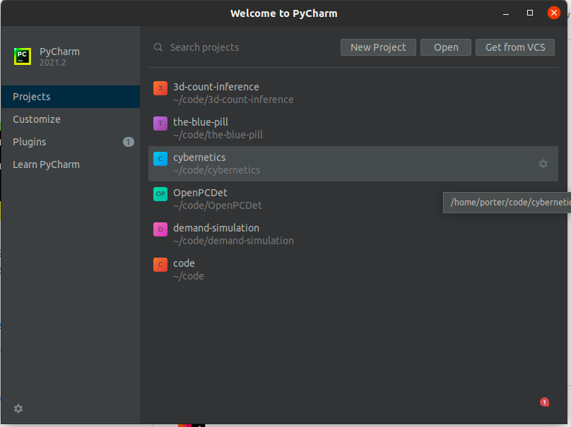
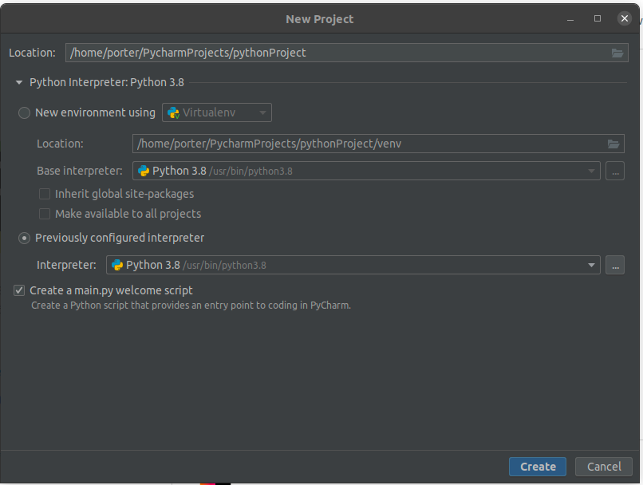
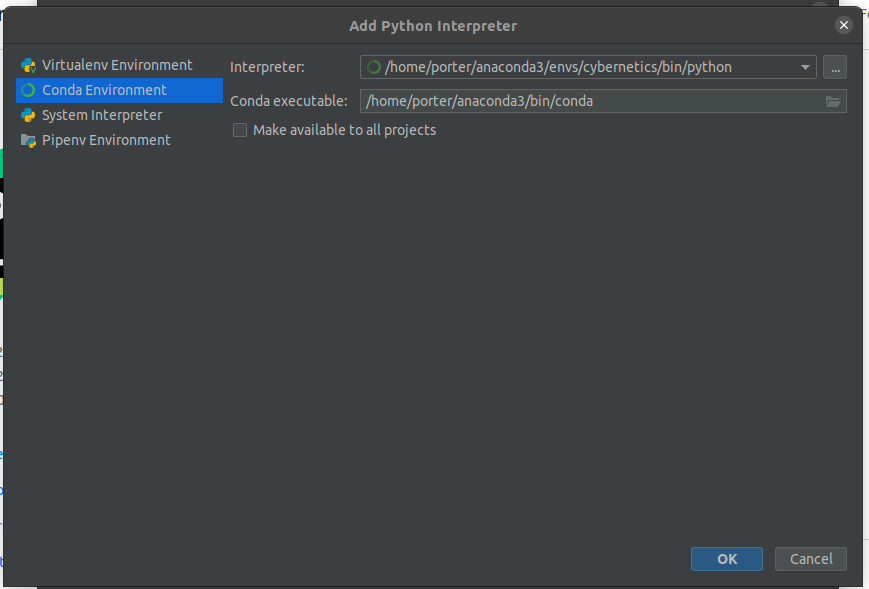
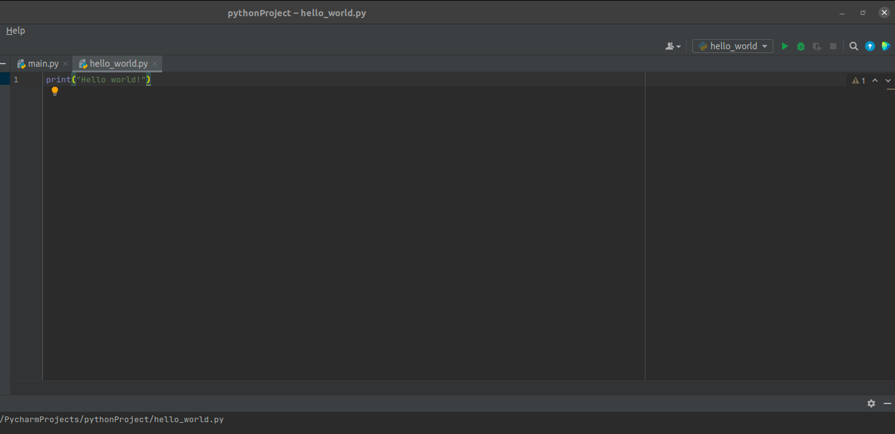
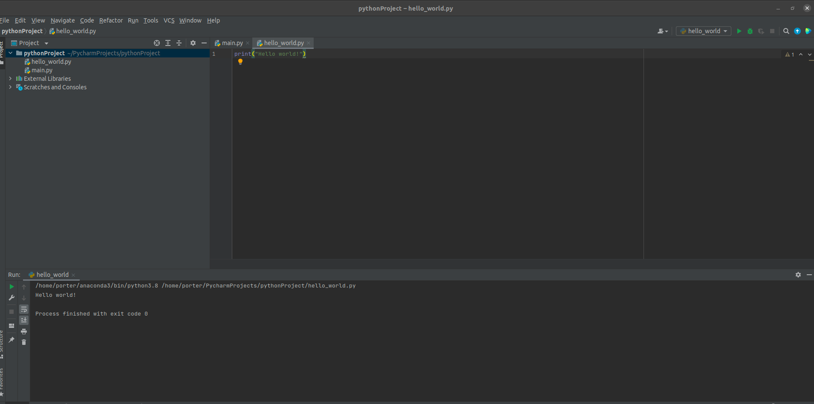

# Python Lab 1: Environment Setup

## Description

You will install anaconda and PyCharm on your laptop. This will help us all (generally) work in the same Python environment.

## Deliverables
- A Single PDF that contains the following:
  - A screenshot that you successfully installed anaconda (Preferably the Anaconda Powershell Prompt, or a terminal that has the prefix (base))
  - A screenshot that you successfully installed and configured PyCharm, and executed your “hello world” program.

### Install anaconda
- MacOS: [Installing on macOS](https://docs.anaconda.com/anaconda/install/mac-os/)

- Windows: [Installing on Windows](https://docs.anaconda.com/anaconda/install/windows/)

- Linux:  [Installing on Linux](https://docs.anaconda.com/anaconda/install/linux/)

### Installing and setting up PyCharm
- Download [PyCharm](https://www.jetbrains.com/pycharm/download)
- Configure interpreter

### Configuring Python Interpreter

Create a “New Project”, by selecting “New Project

Choose your Python interpreter. Many developers find it convenient to [create virtual environments for each project](https://docs.conda.io/projects/conda/en/latest/user-guide/tasks/manage-environments.html#creating-an-environment-with-commands) . This allows the programmer to cleanly manage dependencies across code bases. 

For this class I recommend choosing “Previously configured interpreter”. We will select the base anaconda3 environment by clicking the three dots (“…”) to the right of the arrow:

Select “Conda Environment” on the right pane:

Again, using the three dots to the right of the dropdown, we will specify the path to the Python interpreter we want to use. 

In order to complete this step we need to get the path to where anaconda was installed. It’s typically just in your root user directory: e.g., `/home/porter/anaconda3/` on linux. 

The interpreter will likely be in the `/bin/` subdirectory. See above for a full example.

### Hello World Program

Next we can write our hello world program. The code is trivial: `print(“hello world”)`

To run the code, select the green arrow in the top right on the window:

To verify it runs successfully, look at the terminal output below:

