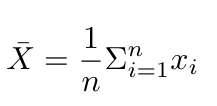
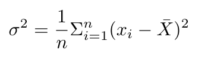

# Python Lab 4

## Description

In statistics, the mean is a measure of central tendency while the variance provides a measure of spread. Both statistics are useful for characterizing the distribution of a random variable.

Write a function that that takes an array with length n and prints the mean and variance as shown in the test cases.

For an array, X, We define the empirical mean as:



And the empirical variance as:



Intuitively, the variance is the average squared difference from the mean.


## Permitted Libraries
`import argparse`

*NOTE: numpy is not permitted for this lab*

## Deliverables
- A single .py file with your code.

- The program takes a list of values as input, --array

- The program returns the mean and variance to the terminal. Be sure to print the output exactly as the test cases show.

## Test Cases

### Test Case 1:

Input:

`python mynetid.py --array 1 2 3 4 5`

Output:

```
mean = 3.0
variance = 2.0
```

### Test Case 2:
Input:

`python mynetid.py --array 1 2 3 4 5 6 7 8 9 10 9 8 7 6 5 4 3 2 1`

Output:
```
mean = 5.2631578947368425
variance = 7.5623268698060935
```

### Test Case 3:
Input:

`python mynetid.py --array 1 2 3 4 5 6 7 8 9 10`

Output:
```
mean = 5.5
variance = 8.25
```